  

 

**We are an IT/OT consultancy from Belgium** that designs and implements scalable industrial architectures. 
We start on the shop floor, in system architecture and process design, and only digitise what adds **measurable value**.

 

## 🏭 &nbsp;What we do

<table>
  <tr>
    <td align="center" width="33%">
      <h3>⚙️</h3>
      <b>Ignition Platform</b>
        
      SCADA / MES / IIoT implementations on Inductive Automation Ignition, plus custom module development
        
    </td>
    <td align="center" width="33%">
      <h3>🕸️</h3>
      <b>Unified Namespace</b>
        
      Event-driven UNS architectures that finally make IT and OT speak the same language
        
    </td>
    <td align="center" width="33%">
      <h3>📈</h3>
      <b>Industrial Historians</b>
        
      Time-series done right with Factry Historian, Canary Labs and TimescaleDB
        
    </td>
  </tr>
  <tr>
    <td align="center" width="33%">
      <h3>📊</h3>
      <b>Data Visualisation</b>
        
      Dashboards that operators actually use, built with Grafana and Ignition Perspective
        
    </td>
    <td align="center" width="33%">
      <h3>🚀</h3>
      <b>OT DevOps</b>
        
      CI/CD pipelines, containerised gateways and reproducible deployments for the plant floor
        
    </td>
    <td align="center" width="33%">
      <h3>🎓</h3>
      <b>Training</b>
        
      Hands-on training so your team owns its digital backbone instead of renting ours
        
    </td>
  </tr>
</table>

 

## 📦 &nbsp;Open source

We believe a solid digital backbone shouldn't be a black box. Some of the tools we share:

| Repository | Description | |
|---|---|---|
| [**ignition-mustry-ui**](https://github.com/Mustry-Solutions/ignition-mustry-ui) | Ignition Perspective component with a branching option, great for track & trace visualisations |  |
| [**ignition-83-cicd**](https://github.com/Mustry-Solutions/ignition-83-cicd) | CI/CD tooling and scripts for Ignition 8.3 gateways |  |
| [**mustry-ads-connector**](https://github.com/Mustry-Solutions/mustry-ads-connector) | Connector that reads and writes Beckhoff TwinCAT ADS |  |
| [**md-to-pdf**](https://github.com/Mustry-Solutions/md-to-pdf) | Markdown to PDF converter |  |
| [**benthos-umh**](https://github.com/Mustry-Solutions/benthos-umh) | Our contributing fork of the United Manufacturing Hub's benthos-umh stream processor | |
| [**factry-historian-ignition-module**](https://github.com/Mustry-Solutions/factry-historian-ignition-module) | Fork of the Factry Historian module for Ignition | |

 

## 🤝 &nbsp;Working with us

Facing structural inefficiencies on your shop floor, or planning your IT/OT integration?

📬 Reach out via [mustrysolutions.com](https://mustrysolutions.com/contact-us) or
[info@mustrysolutions.com](mailto:info@mustrysolutions.com). We'd love to talk architecture first, tools second.

 

